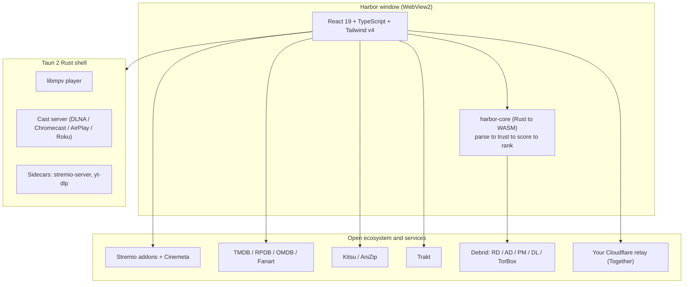

<div align="center">
<a name="readme-top"></a>

<picture>
  <source media="(prefers-color-scheme: dark)" srcset="https://harbor.site/readme-media/harbor-wordmark-dark.svg">
  <source media="(prefers-color-scheme: light)" srcset="https://harbor.site/readme-media/harbor-wordmark-light.svg">
  
</picture>

### A Stremio Client Built for Adventure!


Offering things like a native player, a stream ranking engine, Wikidata, watch parties, PiP, DVR, Live TV, anime, a theme engine, and much more. Check out our website at www.harbor.site for an immersive experience. 

<br/>

[![Version][badge-version]][releases] &nbsp;
[![License][badge-license]][license] &nbsp;
[![Tauri][badge-tauri]][tauri] &nbsp;
[![React][badge-react]][react] &nbsp;
[![Rust core][badge-rust]][rust] &nbsp;
[![Platforms][badge-platforms]][releases]

<br/>

[Why Harbor](#why-harbor) &middot; [Features](#feature-tour) &middot; [Install](#install) &middot; [Configuration](#configuration) &middot; [Architecture](#architecture) &middot; [FAQ](#faq) &middot; [Contributing](#contributing)

</div>

<br/>

<p align="center">
  
  <br/>
  <sub>Harbor on launch: a rotating hero, Continue Watching, and full width rails. Works on Cinemeta out of the box; richer with a free TMDB key.</sub>
</p>


> [!IMPORTANT]
> Harbor is a media player and a client for the open Stremio addon protocol. It hosts, indexes, and ships no media, and it bundles no content addons. You bring your own addons and sources. See the [Disclaimer](#disclaimer).
>Harbor is not for-profit and is a passion project, you are free to sell, re-use or profit off of it. All of your bugs, issues and feedbacks will be addressed promptly as long as scope permits. Please leave a Issue if you have feedback or a bug, so we can better address you. It is HIGHLY reccomended that you build your OWN Harbor from the latest source when available, as our bundled releases will not include windows/os certification/sig (it is a free project) so to avoid any popups we suggest building it yourself. We will try to push updates frequently but we are sometimes segmented by our timezones so it may take some time for your bugs to be rolled into the update endpoint and for us to test it! Thank you for trying it out and helping us make it a better project!
>Stremio has released their **[Supporter tier](https://blog.stremio.com/stremio-supporters-a-way-to-sustain-our-development/)** PLEASE CONSIDER SUPPORTING THEM AND BUYING THIS. We heavily encourage you to use Stremio's Official Apps on Mobile, and Tvs. Harbor is NOT a stremio competitor, it is a different flavor of player for the ecosystem. To get the most out of Harbor, please sign up with a [stremio account](https://stremio.com) (it's free) To Support Stremio visit : https://www.stremio.com/donate (P.S.A Harbor is not endorsed by or created by Stremio ltd or it's contributors it is a independent open sourced project)
<br/>
ATTENTION: HARBOR DOES NOT AND WILL NOT HAVE A DISCORD OR ASK YOU FOR DONATIONS! If someone claims to be us and asks you for donations or to join their discord, IT IS NOT US. Have an issue? Open it on github so you and everyone else can know and see exactly how we messed up, and how we will fix it! Yes we do see your emails to bugs@harbor.site and Bug reports to the bug endpoint FYI the fastest way to get our attention is through github, we will still handle unique reports that have not been already sorted. Want to donate to a good cause visit: National Pediatric Cancer Foundation (https://nationalpcf.org/), Electronic Frontier Foundation (https://www.eff.org/) or St.Jude's (https://www.stjude.org/) email us with a receipt of your donation and we will implement your features in a priority manner. Include NPCF , EFF or SaintJude in title so we can track you! If you have a preferred cause visit https://www.charitynavigator.org/ and donate to a top rated charity of your choice and include CHARITY in email title
<br/>
<br/>
HARBOR IS A OPEN CONCEPT AND NOT A ENTITY. WE DO NOT PROFIT OR ACCEPT MONEY FOR IT. WE DO NOT PROVIDE ANY CONTENT OR TELL YOU HOW TO DO IT. IT IS JUST CODE ON A REPO. IT'S CONTRIBUTORS ARE NOT RESPONSIBLE FOR WHAT YOU DO WITH IT OR WHAT STREMIO ADDONS AND SOURCES YOU ALREADY HAVE. FOLLOW ALL LAWS OF YOUR JURIDSTICTION. 
<br/>
<br/>
<details>
<summary><kbd>Table of contents</kbd></summary>

<br/>

- [Why Harbor](#why-harbor)
- [Feature Tour](#feature-tour)
  - [Rooms and views](#rooms-and-views)
  - [The stream engine](#the-stream-engine)
  - [The player](#the-player)
  - [Casting](#casting)
  - [Together: watch parties](#together-watch-parties)
  - [Live TV and Multiview](#live-tv-and-multiview)
  - [Anime](#anime)
  - [Addons](#addons)
  - [Themes and customization](#themes-and-customization)
  - [Integrations](#integrations)
  - [Quality of life extras](#quality-of-life-extras)
- [Privacy](#privacy)
- [Install](#install)
- [Configuration](#configuration)
- [Build from source](#build-from-source)
- [Architecture](#architecture)
- [Roadmap](#roadmap)
- [FAQ](#faq)
- [Contributing](#contributing)
- [Disclaimer](#disclaimer)
- [Acknowledgements](#acknowledgements)
- [License](#license)

</details>

<br/>

## Why Harbor

**Harbor** is a self contained desktop client for the Stremio ecosystem. Out of the box it runs on Cinemeta. Add a free TMDB key and it blossoms into your ultimate companion for discovering and watching content. Harbor was built around the Stremio addon ecosystem with deep native integration of popular services and features into the UI. 

- **A native player.** libmpv decodes virtually any codec and container, with HDR passthrough, skip intro/outro, Anime4K upscaling shaders, and more. Delivering the same quality you are used to, but on a native custom player.
- **Customize it your way.** Harbor is built in rust and tauri, allowing full on demand customization of the entire application. Harbor does not inject into stremio web, it is its own from scratch shell, layered over the stremio ecosystem, allowing you to go beyond the traditional themeing. Customize the player's UI, your fonts, seek bar, colors or the entire thing! 
- **Theme Studio & Editor** Noob friendly theme studio lets anyone create their own custom theme with no code. Those that want control over every file can use a built in code editor for your themes.
- **Intelligent stream ranking.** A pure Rust engine (compiled to WASM, with a TypeScript fallback) that parses every stream, filters out scams and fakes, and ranks high quality sources first.
- **Corpus Engine.** During the initial release of In-cinema movies, Harbor gates the results based on heuristic factors like file size, average quality consensus, year and metadata ranking and other factors to deliver you a cleaner experience during the period of a fresh release. Harbor will surface the most likely CAMS, TeleSyncs/Telecines and other reasonable options without you needing to do anything.
- **Go Deep.** Dive deep into your favorite shows, actors, genres and more. View lists of award recipients for the Oscars, BAFTA, Cannes, SAG, and more. Anime cast and award metadata, along with Episode/Season Deduplication and Merge. Your rows learn from your watch history and likes, to always suggest you your next best watch.
- **Robust Appstore.** Harbor allows you to configure and install addons without leaving the desktop client by allowing you to natively install third party addons via a built in viewport. Easily manage your installed Addons and Browse for new ones in a bespoke experience that merges the Stremio Community addons API with the [Stremio-addons.net](https://stremio-addons.net) API, giving you wide coverage and custom reccomendations.
- **Stremio-addons.net Integration.** The first platform with direct community ratings, top trending, and manifest feed to the [Stremio-addons.net](https://stremio-addons.net) API
- **Watch together, on your own relay.** A synced watch party with live on screen cursors and drawing, on a relay that deploys to your own Cloudflare account in one click. No central server.
- **Live TV and Multiview.** Bring M3U or Xtream playlists and get a real EPG grid guide, favorites, catchup, and up to four channels at once in a grid. Missed the show? play a rerun or record the next episode using built in DVR. Switch channels while in the live player at any time with the TV Guide
- **Stream switcher** In player switcher allows you to hop streams if you get served a bad one without leaving the player and going through results again. Play next episodes with ease on the player UI controls or in a full "Next Up" sidebar. 
- **Casts across the room.** DLNA/UPnP, Chromecast, AirPlay, and Roku via a bundled Rust cast server and a web cast receiver.
- **Integrations.** Feature rich discord rich presence integration, webhooks for Discord and Telegram, Trakt Sync, and native integrations to TMDB, OMDB, Fanart.Tv, RPDB and more! Customize the  location and what badges are shown.
- **And much more! (seriously this would be very long)** 
<p align="right"><a href="#readme-top">&#9650; back to top</a></p>

## Feature Tour

<table>
<tr>
<td width="33%" valign="top">

**Browse and discover**

Ten primary rooms: Home, Discover, Movies, Shows, Anime, Live TV, Calendar, My Library, Addons, Settings. A taste scored Discover feed, a swipeable Discovery Queue, and a release Calendar that pulls from TMDB, your library, and Trakt.

</td>
<td width="33%" valign="top">

**Play anything**

Native libmpv with HDR passthrough, skip intro/outro, Anime4K shaders, custom subtitles , picture in picture, frame grab, A/B loop, sleep timer, fully remappable hotkeys and more.

</td>
<td width="33%" valign="top">

**Make it yours**

Eleven themes and seven font pairings, a live theme studio for every token, custom backgrounds and fonts, import/export, and a theme library. Multiple profiles, parental PIN gates, 40+ regions, webhooks, and Telegram+Discord notifications.

</td>
</tr>
</table>

<table>
<tr>
<td width="50%" align="center">
<br/>
<sub><b>Detail page</b> &middot; ratings from IMDb, Rotten Tomatoes, and MAL, award laurels, cast and crew, episodes, and region aware Watch on chips.</sub>
</td>
<td width="50%" align="center">
<br/>
<sub><b>Discover</b> &middot; up to 14 rotating daily rails tuned by what you open, play, and save, plus a daily Critics Pick.</sub>
</td>
</tr>
<tr>
<td width="50%" align="center">
<br/>
<sub><b>Player</b> &middot; native libmpv, trickplay seek previews, skip intro/outro, and a customizable seek bar.</sub>
</td>
<td width="50%" align="center">
<br/>
<sub><b>Live TV</b> &middot; M3U and Xtream playlists rendered as a real EPG grid guide with favorites and catchup.</sub>
</td>
</tr>
<tr>
<td width="50%" align="center">
<br/>
<sub><b>Multiview</b> &middot; one, two, three, or 2x2 streams at once, with independent audio focus per tile.</sub>
</td>
<td width="50%" align="center">
<br/>
<sub><b>Together</b> &middot; synced playback, a live chat overlay, on screen cursors, and collaborative drawing.</sub>
</td>
</tr>
<tr>
<td colspan="2" align="center">
<br/>
<sub><b>Themes</b> &middot; eleven presets and a full visual studio. Colors, fonts, card and button shapes, backgrounds, and the entire nav layout.</sub>
</td>
</tr>
</table>

<br/>

### Rooms and views

Harbor is organized into ten primary rooms, each with its own cinematic hero and curated rails, plus per title flows layered on top.

| Room | What you get |
|---|---|
| **Home** | Rotating four slide hero with an image derived color halo &middot; Continue Watching (16:9 cards, polled while focused) &middot; Top 10 numerals row &middot; trending, theaters, popular, and per service rails &middot; Trakt recommendation rails &middot; a drag to reorder row customizer &middot; a Classic Stremio mode that renders raw addon catalogs |
| **Discover** | A taste scored feed of up to 14 daily rails &middot; a cinematic featured banner that excludes what you have watched &middot; a genre tile grid &middot; a daily editorial Critics Pick &middot; a teaser into the swipeable Discovery Queue |
| **Movies** | A CinemaHero banner &middot; Top 10 Today numerals &middot; 15+ paginating rails: trending, in theaters, mood rows, all time greats, hidden gems, quick watches under 90 minutes, decade rows, world cinema rows, documentaries |
| **Shows** | A PeekHero banner &middot; Continue Watching for in progress series &middot; 18+ rails: on tonight, premiered this month, network rows (HBO, Apple TV+, AMC, FX and more), limited series, prestige drama, K-drama, British television |
| **Anime** | An award winner first hero with a personalized Top Picks panel &middot; a genre "tune picks" filter &middot; Continue Watching scoped to Kitsu/MAL &middot; 18 spec driven rails by era, genre, and ranking, with award badges on winners |
| **Live TV** | M3U and Xtream playlists as a real EPG grid guide &middot; categories and favorites &middot; a channel picker &middot; top network rows by region &middot; catchup &middot; and Multiview (several channels at once) |
| **Calendar** | A month grid across five sources (All/TMDB, Library, Trakt watchlist, Trakt anticipated, Custom) &middot; filter pills with live counts &middot; a day modal with posters and synopses |
| **My Library** | Watchlist, History, Local files, library repair, and a full Trakt library browser when connected |
| **Addons** | Discover, Browse, and Installed tabs &middot; the [stremio-addons.net](https://stremio-addons.net) community index &middot; add by URL &middot; configurable addon setup viewport &middot; addon detail pages with related and recommended &middot; an adult age gate |
| **Settings** | Thirteen sections: account and profiles, library repair, Trakt, parental, relay, streaming keys, languages, player layout, hotkeys, bandwidth, themes, advanced, and onboarding replay |

Per title flows add **Detail**, **Person**, **Award**, **Service**, and **Filter** views on top of the rooms above, each with full backdrops, clickable award laurels, drill down modals, and per key scroll memory.

> [!NOTE]
> Sports page will be rolled out in upcoming releases, Parental Controls being reworked (if you see parental controls stub itll be pruned we are gonna leave some temp stubs for parity sake (this note will be removed in upcoming releases)

> [!TIP]
> Scroll position is remembered per view, per title, per person, and per filter. Navigate back and you land exactly where you left off.

<p align="right"><a href="#readme-top">&#9650; back to top</a></p>

### The stream engine

When you press play, Harbor collects stream offers from every installed addon in parallel and runs them through a four stage pipeline. Inside the desktop app this runs in **harbor-core**, a pure Rust crate compiled to WASM and invoked from the UI, with a TypeScript fallback if it is ever unavailable.

```
parse  ->  trust  ->  score  ->  rank
```

| Stage | What happens |
|---|---|
| **Parse** | Extracts resolution, HDR flavor (Dolby Vision, HDR10, HDR10+, HLG), video codec, source type, audio codec and channel layout (Atmos, TrueHD, DTS-HD MA, 5.1/7.1), languages, file size, seeders, container, release group, edition tags, season/episode, and an anime aware filename pass for CRC and batch ranges |
| **Trust** | Drops dead links, placeholders, cams and telecines, trailers and extras, undersized stubs, cinema window fakes, and title, year, season, or episode mismatches; floats well regarded release groups upward |
| **Score** | Rewards debrid cached sources, resolution, HDR and lossless audio, seeders, trusted release groups, REMUX, and preferred language matches; penalizes cams, mismatches, and implausible sizes. Every signal is recorded so the reason is inspectable |
| **Rank** | Sorts into quality tiers (4K DV, 4K HDR, 4K, 1080p HDR, 1080p, 720p, SD) and surfaces the best cached pick first, with partial results streamed to the UI as addons respond |

Debrid services are checked live and uniformly: **Real-Debrid, AllDebrid, Premiumize, Debrid-Link, and TorBox**. Cache hints embedded by popular addons are read directly, and every torrent hash is cross checked against your debrid library to catch what the cache API misses. No debrid is required: Harbor can stream torrents directly through the bundled Stremio Server engine. All keys stay on your device.

<p align="right"><a href="#readme-top">&#9650; back to top</a></p>

### The player

A native libmpv player, with HLS and MPEG-TS engines for live and broadcast sources, and an Auto mode that picks the right backend per source.

| Capability | Detail |
|---|---|
| **Engines** | Native libmpv (bundled) or HTML5/WebView2, with an Auto mode; hls.js and mpegts.js for live; embedded or separate window mpv |
| **Resilience** | Auto retry and auto advance that detect black screens, frozen positions, and hard stalls; fallback to the Stremio Server HLS transcoder on a decode error; automatic live IPTV reconnect |
| **Picture** | HDR passthrough, HDR to SDR tonemapping (bt.2446a), Anime4K GLSL upscaling shaders, a stats overlay |
| **Skip segments** | Intro, outro, and recap detection from AniSkip, TheIntroDB, and embedded chapter markers |
| **Subtitles** | OpenSubtitles v3 and Wyzie plus your subtitle addons, deduped and language ranked; SRT/VTT/ASS/SUB with encoding detection; **dual tracks**; full styling (font, size, color, outline, box, margin, alignment, custom font upload); SDH and forced flags; ASS override; per item delay; and a show/hide toggle in picture in picture |
| **Resume and sync** | Picks up from your saved position, merged with Stremio library mtime; writes progress back every few seconds and flags watched at 85% |
| **Convenience** | Picture in picture, A/B loop, sleep timer, frame grab, stream download via bundled yt-dlp, next/previous episode with auto advance, and a fully remappable 21 action hotkey set |
| **Seek bar** | Flat, glass, pinstripe, rainbow, or custom image styles; adjustable height, color, and dot shape, or use custom JS, all with a live preview |
| **Player Editor** | Change your players UI layout, style, and more with a 1:1 player editor |

<p align="right"><a href="#readme-top">&#9650; back to top</a></p>

### Casting

Send any playback across the room through a bundled Rust cast server and a web cast receiver.

- **Chromecast** via Harbor's own CAF receiver (HLS, MP4, and unknown formats). (Visit harborstremio/cast-receiver-chrome)
- **DLNA / UPnP** with vendor aware handling for Samsung, Sony, LG, Panasonic, and Hisense.
- **AirPlay** discovery and playback.
- **Roku** via the ECP protocol, with guidance for network access and Media Assistant. (Pre and post roku update) Does require Roku tv addons
- An optional "always re-encode" path pipes streams through ffmpeg (H264 + AAC + MPEGTS) for maximum receiver compatibility, and playback resumes locally when casting stops.

> [!NOTE]
> Casting support varies by device. Chromecast receiver and DLNA/UPnP are tested and working, with verified success on devices such as Google Nest Hub + Chromecast Dongle and a Samsung Q60T. Apple TV 4K, HomePod, and Vision Pro require AirPlay 2 (Soon); legacy AirPlay 1 is rejected by most modern devices. Roku support is in testing please submit feedback!! If a device does not appear, please open an [issue][issues] with the model so we can expand the matrix.

<p align="right"><a href="#readme-top">&#9650; back to top</a></p>

### Together: watch parties

- Create or join a room with a six character code; invite by link.
- Synced play, pause, and seek with RTT adjusted clock alignment so everyone stays together.
- Live chat, **on screen cursors** with named colors, and **collaborative drawing** over the video.
- A host can summon everyone to a view or a title and send play invites that late joiners receive on connect.
- The relay deploys to **your own Cloudflare account in one click** (deploy, check, and delete from inside Harbor). There is no central Harbor server in the loop.

<p align="right"><a href="#readme-top">&#9650; back to top</a></p>

### Live TV and Multiview

| Area | Detail |
|---|---|
| **Sources** | M3U playlist URLs, Xtream Codes credentials (auto builds M3U + EPG), and standalone XMLTV; multiple playlists, on demand refresh, edit, delete, and export back to `.m3u` |
| **Browser** | A responsive channel grid with logos, live program titles and progress, favorites, and posters for matched titles |
| **Categories** | A chip strip and a searchable sidebar with counts; a Favorites virtual category; live text search |
| **Top networks** | Auto generated curated network rows by region (US, UK, Brazil and more), with HD preferring channel scoring |
| **EPG guide** | A horizontal timeline grid with a Now indicator and per program blocks; ended programs with catchup are replayable |
| **Catchup** | Auto detected timeshift across default, append, shift, flussonic, and Xtream methods |
| **Multiview** | One, two, three, or 2x2 streams at once; per tile channel swap, audio focus, and auto reconnect; native video geometry synced to the window layout |

<p align="right"><a href="#readme-top">&#9650; back to top</a></p>

### Anime

Anime is a first class room with its own metadata stack. Metadata comes from **Kitsu** and **AniZip** for cross database ID mapping and per episode detail, with TMDB matching for logos and backdrops. Award winners from the Crunchyroll Awards, TAAF, JMAF, r/anime, and Animation Kobe are surfaced first and badged. Detail pages show MAL scores, streaming service chips (Crunchyroll, HIDIVE, Funimation and more), and an award corner. AniSkip drives skip intro/outro, and Anime4K shaders sharpen playback.

<p align="right"><a href="#readme-top">&#9650; back to top</a></p>

### Addons

The Addons room is a full browser and installer for the Stremio ecosystem.

- **Discover** trending and top community addons via the [stremio-addons.net](https://stremio-addons.net) index.
- **Browse** by category and open an addon's detail page with related and recommended addons.
- **Install** from the catalog, add by URL, or follow a `harbor://` / `stremio://` deep link.
- **Configure** addons that require setup: Harbor opens the addon's own configuration view rather than installing without it.
- **Manage** installed addons, which also sync to your Stremio account collection.
- An age gate keeps adult addons behind an explicit opt in.

<p align="right"><a href="#readme-top">&#9650; back to top</a></p>

### Themes and customization

Harbor's theme engine changes more than colors. A theme can reshape the entire navigation layout.

| | |
|---|---|
| **11 presets** | Harbor (default), Nord, Stremio, Crunchy, Royal, Dracula, Forest, Noir, Aurora, MinUI, Velvet |
| **Layouts** | Left sidebar, top dock, icon rail, Stremio rail, floating dock, or fully custom HTML/CSS chrome |
| **Fonts** | Seven pairings plus custom TTF/OTF/WOFF/WOFF2 upload |
| **Surfaces** | Five card styles, four button styles, an optional animated bokeh layer, and a full bleed background image with a dim slider |
| **Theme Studio** | A live slide in editor with Look, Layout, and Code tabs; a 10 swatch color editor; a custom chrome builder; raw CSS/HTML/JS layers; and a built in cheat sheet |
| **Library** | Import and export `.harborstyle` files, manage a personal theme library, and apply, copy, download, or delete any theme, with a badge marking imported themes |

<p align="right"><a href="#readme-top">&#9650; back to top</a></p>

### Integrations

| Service | What it adds |
|---|---|
| **Cinemeta** | Works out of the box: catalogs, metadata, and posters with no key |
| **TMDB** (free key) | Trending, In Theaters, On The Air, Top Rated, and eight per service rails (Netflix, Disney+, Hulu, Prime, Apple TV+, Max, Paramount+, Peacock), region aware Watch on chips, trailers, full cast and crew, and IMDb ID resolution |
| **RPDB** | Bakes rating overlays directly onto posters, for both IMDb and TMDB ID schemes, with transparent fallback |
| **OMDB** | IMDb, Rotten Tomatoes, and Metascore ratings, a Certified Fresh flag, and structured award counts, with a daily request budget |
| **Fanart.tv** | HD logos, backdrops, posters, banners, and thumbs for movies and series |
| **Kitsu / AniZip** | Anime metadata, cross database ID mapping, and per episode detail |
| **Trakt** | OAuth device sign in, automatic scrobbling, watchlist and history, personalized movie and series recommendations, an Up Next calendar rail, and your avatar in the sidebar |
| **Stremio** | Account sign in, Continue Watching sync, installed-addon collection sync, and catalog, meta, stream, and subtitle resources from every installed addon |
| **Debrid** | Real-Debrid, AllDebrid, Premiumize, Debrid-Link, and TorBox for cached, instant playback |

Awards laurels surface across detail pages, covering Oscar, Emmy, BAFTA, Golden Globe, SAG, Cannes, Berlin, Critics Choice, and Annie/Kobe honors.

> [!TIP]
> A free TMDB key from [themoviedb.org/settings/api](https://www.themoviedb.org/settings/api) is the single highest impact thing you can add. No payment required.

<p align="right"><a href="#readme-top">&#9650; back to top</a></p>

### Quality of life extras

- **Multiple profiles**, each with its own parental settings, content hiding, and PIN. Switching profiles resets unlocks.
- **Parental controls** that PIN gate any room and hide Anime or Live TV per profile.
- **A player layout editor** with drag and drop placement of the on screen HUD.
- **Languages** with 26 options and reordering.
- **Hotkeys** with a rebind UI and conflict detection.
- **Bandwidth** controls including a cap and a built in speed test.
- **Library repair** for your Stremio library.
- **Region awareness** across 40+ regions, driving theatrical windows and streaming availability.
- **Notifications** via Discord webhooks and Telegram, with calendar sources, media type filters, and per rule routing.
- **Discord Rich Presence** with poster art, live progress, and watch party size.
- **A built in bug reporter** that auto collects safe diagnostics (no secret values).
- **Backup and restore** of your full setup to a `.harbx` file.
- **Classic Stremio home mode** that renders every addon catalog row.
- **Deep links** for `harbor://` and `stremio://`, with single instance focus.
- **Custom CSS, JS, and HTML overlays** for power users.
- **Trickplay scrub previews** decoded on the fly for torrents and local files, so the seek bar shows the exact frame you are hovering.

<p align="left">
  
  <br/>
  <sub>Trickplay seek previews, generated live for torrents and local files.</sub>
</p>

<p align="left">
  
  <br/>
  <sub>Discord Rich Presence, cycling live as you browse and watch.</sub>
</p>

<p align="right"><a href="#readme-top">&#9650; back to top</a></p>

## Privacy

Harbor is built to keep your data on your machine.

- **No telemetry.** Harbor collects no analytics and sends nothing home.
- **Your keys stay local.** TMDB, RPDB, OMDB, Trakt, and debrid credentials live on your device.
- **No central server.** Watch party relays deploy to your own Cloudflare account, and casting runs on your own network. Nothing is routed through a Harbor operated backend.
- **A built in privacy blocker** at the WebView level, with a live counter.
- **You choose your sources.** What metadata and streams Harbor sees is entirely determined by the addons and services you configure.

<p align="right"><a href="#readme-top">&#9650; back to top</a></p>

## Install

Download the latest build for macOS or Windows from the [Releases page][releases], or open Harbor in your browser.

| Platform | Format |
|---|---|
| **macOS** | `.dmg` (macOS 11.0 or newer) |
| **Windows** | `.exe` NSIS installer (current user install) |
| **Web** | Open in any modern browser, nothing to install |
| **Linux** | In testing, coming soon (`.deb`, `.rpm`, and `.AppImage` planned) |

> [!NOTE]
> macOS, Windows, and the web are supported at launch. A native Linux build is in testing right now.

### Linux (in testing, coming soon)

<p align="center">
  
  <br/>
  <sub>Harbor running natively on Linux, in a Together watch party.</sub>
</p>

Linux is up and running natively, and it is in active testing right now. We decided to take a couple extra weeks so the native player feels great for full time Linux users before we call it ready. Coming soon.

**Out of the box, Harbor works on Cinemeta.** You can browse, play, and cast immediately. Adding a free **TMDB key** in Settings is optional and unlocks the richer trending, theaters, per service, and Watch on experiences described above. Your installed Stremio addons merge in automatically when you sign in, deduplicated against the built in rails.

<p align="right"><a href="#readme-top">&#9650; back to top</a></p>

## Configuration

All keys and preferences live in **Settings** and persist locally. Nothing is sent to a Harbor server.

| Setting | Default | What it does |
|---|---|---|
| `Stremio sign in` | signed out | Library sync, Continue Watching, and installed-addon collection |
| `TMDB API key` | none | Unlocks trending, in theaters, on the air, top rated, per service rails, and Watch on chips |
| `RPDB API key` | none | Bakes rating overlays onto posters |
| `OMDB API key` | none | Adds Rotten Tomatoes and Metascore ratings and award counts |
| `Fanart.tv API key` | none | Adds HD logos, backdrops, and artwork |
| `Region` | `US` | ISO 3166-1; drives theatrical windows and streaming availability |
| `Debrid keys` | none | Real-Debrid, AllDebrid, Premiumize, Debrid-Link, TorBox; used by the stream engine |
| `Player engine` | `Auto` | Auto, native libmpv, or HTML5/WebView2 |
| `Stream safety filter` | `Strict` | Strict, Balanced, or Off; controls how aggressively cams and mismatches are dropped |
| `Trakt` | disconnected | OAuth device sign in for scrobbling, watchlist, history, and recommendations |

<p align="right"><a href="#readme-top">&#9650; back to top</a></p>

## Build from source

Harbor is a Tauri 2 app: a React + TypeScript frontend and a Rust shell, with the stream engine living in the `harbor-core` Rust crate.

**Prerequisites**

- [Node.js](https://nodejs.org/) 20+ and [pnpm](https://pnpm.io/)
- The [Rust toolchain](https://rustup.rs/) (stable)
- The [Tauri 2 system prerequisites](https://v2.tauri.app/start/prerequisites/) for your OS
- [`wasm-pack`](https://rustwasm.github.io/wasm-pack/) (only needed to rebuild the WASM stream core)

<details>
<summary><b>Run in development</b></summary>

<br/>

```bash
pnpm install
pnpm tauri dev
```

For frontend only iteration with hot reload:

```bash
pnpm dev
```

</details>

<details>
<summary><b>Build a release bundle</b></summary>

<br/>

```bash
pnpm install
pnpm tauri build
```

Bundles are emitted for your platform (dmg on macOS, NSIS on Windows; Linux deb, rpm, and AppImage targets are in progress).

</details>

<details>
<summary><b>Rebuild the Rust stream core (harbor-core)</b></summary>

<br/>

```bash
cargo test --manifest-path harbor-core/Cargo.toml
wasm-pack build harbor-core --target web
```

</details>

<p align="right"><a href="#readme-top">&#9650; back to top</a></p>

## Architecture



<details>
<summary><kbd>Full stack and repo layout</kbd></summary>

<br/>

**Stack**

- **Shell:** Tauri 2 (Rust + WebView2), frameless Mica window
- **Frontend:** React 19, TypeScript 5.8, Tailwind v4 (`@theme` tokens), Vite 7, Lucide icons
- **Stream core:** `harbor-core`, a pure Rust crate compiled to WASM and rlib
- **Player:** native libmpv, with hls.js and mpegts.js for live
- **Casting:** a bundled Rust cast server plus a web cast receiver
- **Sidecars:** `stremio-server`, `yt-dlp`

**Repo layout**

```
src/                 React frontend (views, chrome, components, lib)
src-tauri/           Rust shell, player, casting, sidecars
  src/               cast.rs, dlna.rs, roku.rs, airplay.rs, transcode.rs, discord_rp.rs, ...
harbor-core/         pure Rust stream engine (parse, trust, score) -> WASM
cast-receiver/       web cast receiver app
docs/media/          logos and screenshots
```

</details>

<p align="right"><a href="#readme-top">&#9650; back to top</a></p>

## Roadmap

Directional, not a set of promises. Priorities shift with feedback.

- [x] Native libmpv player with trickplay and skip segments
- [x] Rust stream ranking core (`harbor-core`) compiled to WASM
- [x] Watch parties with cursors and drawing on a self hosted relay
- [x] Live TV EPG guide and Multiview
- [x] First class anime room with Kitsu and AniZip
- [x] Theme studio with custom layouts
- [x] macOS, Windows, and web launch builds
- [ ] Native Linux build (in testing, a couple weeks of native player polish to go)
- [ ] Expanded casting device matrix (AirPlay 2, more Roku and Chromecast targets)
- [ ] More translations
- [ ] A growing theme gallery

<p align="right"><a href="#readme-top">&#9650; back to top</a></p>

## FAQ

**Does Harbor provide content?**
No. Harbor hosts and indexes nothing. It is a client for the Stremio addon protocol, and what you can browse or play depends entirely on the addons and services you configure.

**Do I need a TMDB key?**
No. Harbor works out of the box on Cinemeta. A free TMDB key is recommended because it unlocks trending rails, in theaters, top rated, per service rows, and Watch on chips.

**Is Harbor affiliated with Stremio?**
No. Harbor is an independent open source client built on the open Stremio addon protocol, by someone who loves the ecosystem.

**Why Tauri instead of Electron?**
Tauri uses the system WebView and a Rust backend, which keeps the app small and lets the stream ranking core run as compiled WebAssembly.

**Do I need a debrid account?**
No. You can stream torrents directly through the bundled Stremio Server engine. A debrid service is optional and adds cached, instant playback.

<p align="right"><a href="#readme-top">&#9650; back to top</a></p>

## Contributing

Contributions are very welcome, whether that is code, a bug report, a theme, or a docs fix.

**Getting started**

1. Fork the repo and clone your fork.
2. Follow [Build from source](#build-from-source) to get a dev build running.
3. Create a branch, make your change, and run `pnpm build` to verify the frontend compiles.
4. Open a pull request with a clear description of what changed and why, with screenshots for UI work.

**Filing issues**

- Found a bug? Open an [issue][issues] with steps to reproduce. Harbor also has a built in **Report a Bug** form in Settings that attaches safe diagnostics for you.
- Have an idea? Start a [discussion][discussions] or open a feature request issue.

We aim to respond to issues and pull requests promptly. Be kind, be specific, and assume good faith. We are glad you are here.

<p align="right"><a href="#readme-top">&#9650; back to top</a></p>

## Disclaimer

> [!IMPORTANT]
> Harbor is an independent, open source media player and a client for the open Stremio addon protocol. It is not affiliated with, endorsed by, or associated with Stremio Ltd. Harbor hosts no media, indexes no media, and ships no content addons. It provides no streams of its own. You choose which addons and sources to configure, and you are responsible for ensuring that your use complies with the laws of your jurisdiction and with the terms of any service you connect.

<p align="right"><a href="#readme-top">&#9650; back to top</a></p>

## Acknowledgements

Harbor stands on the shoulders of a generous open ecosystem and the people who build it.

- The **Stremio addon protocol** and the **Stremio** team, for an open, well designed standard worth building on.
- The **[Stremio-addons.net](https://stremio-addons.net) Team** for providing an excellent service (please consider supporting them).
- [@stass_motion](https://pro.fiverr.com/freelancers/stass_motion) for the lottie animations, he is fantastic consider supporting him.
- **Cinemeta** and the wider **addon community**, whose work makes the experience possible out of the box.
- **TMDB**, **Trakt**, **OMDB**, **Fanart.tv**, **RPDB**, **Kitsu**, and **AniZip** for the metadata that brings catalogs to life.
- **libmpv** for a world class playback engine, and the **Anime4K** project for its upscaling shaders.
- **Tauri**, **React**, **Vite**, **Tailwind CSS**, **Rust**, and **Lucide** for the foundation.
- **OpenSubtitles**, **Wyzie**, **AniSkip**, and **TheIntroDB** for subtitles and skip data.


Thank you to everyone, named and unnamed, whose open work Harbor builds upon.

<p align="right"><a href="#readme-top">&#9650; back to top</a></p>

## License

[MIT](./LICENSE) &copy; 2026 Harbor contributors. Free Speech!

<br/>

<div align="center">
<picture>
  <source media="(prefers-color-scheme: dark)" srcset="https://harbor.site/readme-media/harbor-mark.svg">
  
</picture>
<br/><br/>
<sub>Built with care for the people who love good cinema and an open web. <a href="#readme-top">&#9650; back to top</a></sub>
</div>

<!-- reference links -->
[releases]: https://github.com/harborstremio/harbor/releases
[issues]: https://github.com/harborstremio/harbor/issues
[discussions]: https://github.com/harborstremio/harbor/discussions
[license]: ./LICENSE
[tauri]: https://v2.tauri.app/
[react]: https://react.dev/
[rust]: https://www.rust-lang.org/

<!-- badges -->
[badge-version]: https://img.shields.io/badge/version-0.9.12-D9A441?style=for-the-badge&labelColor=1a1a1a
[badge-license]: https://img.shields.io/badge/license-MIT-D9A441?style=for-the-badge&labelColor=1a1a1a
[badge-tauri]: https://img.shields.io/badge/Tauri-2-24C8DB?style=for-the-badge&logo=tauri&logoColor=white&labelColor=1a1a1a
[badge-react]: https://img.shields.io/badge/React-19-61DAFB?style=for-the-badge&logo=react&logoColor=white&labelColor=1a1a1a
[badge-rust]: https://img.shields.io/badge/core-Rust%20to%20WASM-DEA584?style=for-the-badge&logo=rust&logoColor=white&labelColor=1a1a1a
[badge-platforms]: https://img.shields.io/badge/macOS%20%C2%B7%20Windows%20%C2%B7%20Web-Linux%20soon-8a8a8a?style=for-the-badge&labelColor=1a1a1a
